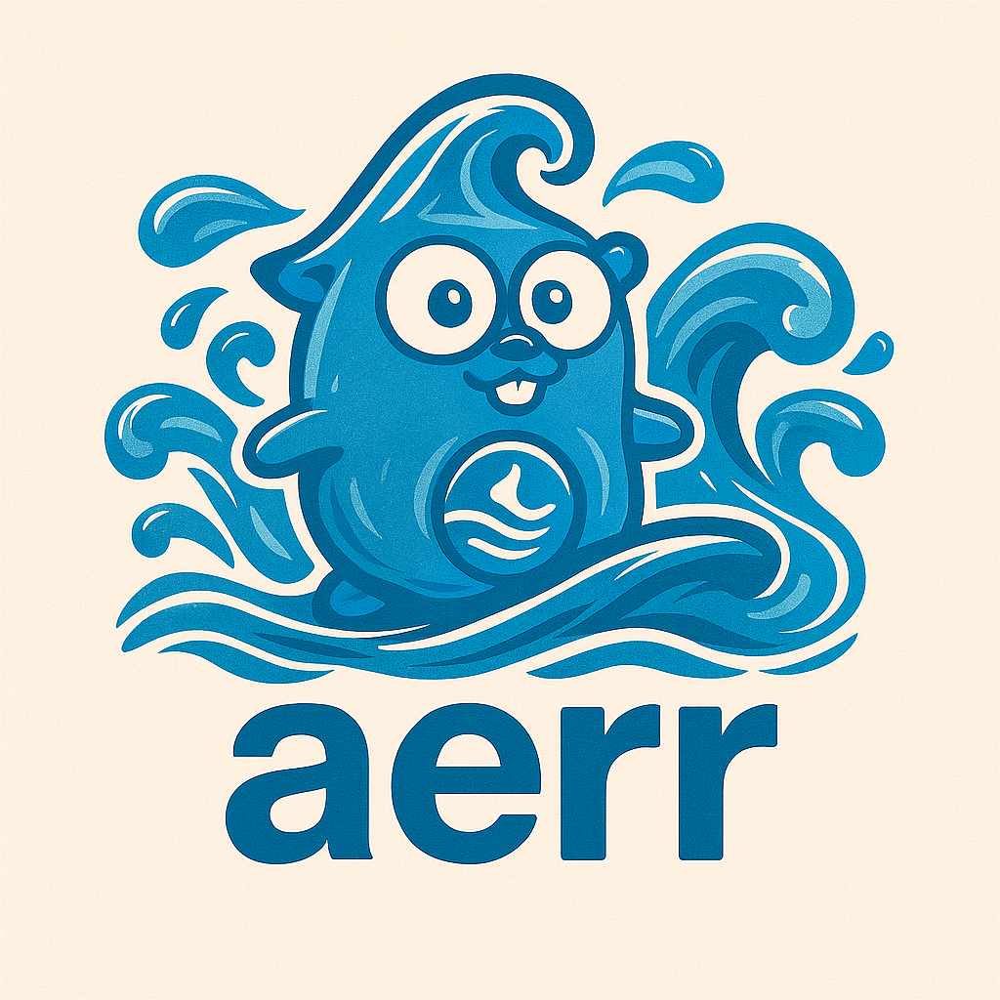

<div align="center">




**Lightweight error handling with structured logging and stack trace support for Go**

</div>

---

## Philosophy

Inspired by **"air"** (water in Indonesian), aerr embodies the natural flow of water from downstream to upstream. Just as water brings life along its journey, error information should flow seamlessly through your application layers—carrying vital context from where it originates to where it's resolved.

When errors flow smoothly with complete context (codes, messages, attributes, stack traces), engineers can diagnose and fix issues faster, bringing life back to their systems. aerr makes error tracking effortless, transforming debugging from a painful search into a clear path to resolution.

> *"Like water flowing upstream, errors should carry the important context they've collected along their journey."*

## Features

- **Automatic stack trace capture** - Every error captures where it was created with function names
- **Simplified error output** - Single code, combined message, merged attributes
- **Structured logging** - Stack traces as structured data, not strings
- **Method chaining** - Fluent API for both errors and logging
- **slog integration** - First-class support for Go's structured logging
- **High performance** - Optimized to minimize allocations
- **Zero dependencies** - Only uses Go standard library

## Installation

```bash
go get github.com/tafaquh/aerr
```

## Quick Start

```go
package main

import (
    "errors"
    "log/slog"
    "os"
    "github.com/tafaquh/aerr"
)

func main() {
    // Setup default slog logger
    slog.SetDefault(slog.New(slog.NewJSONHandler(os.Stdout, nil)))

    // Create error with builder pattern
    err := aerr.Code("DB_ERROR").
        Message("failed to query user").
        StackTrace().
        With("user_id", "123").
        With("table", "users").
        Err(errors.New("connection timeout"))

    // Just use slog.Error - it automatically structures everything!
    slog.Error("operation failed", slog.Any("err", err))
}
```

Output:
```json
{
  "time": "2025-10-31T09:07:57Z",
  "level": "ERROR",
  "msg": "operation failed",
  "err": {
    "code": "DB_ERROR",
    "message": "failed to query user: connection timeout",
    "attributes": {
      "user_id": "123",
      "table": "users"
    },
    "stacktrace": [
      "/path/to/main.go.(main.main):34",
      "/usr/local/go/src/runtime/proc.go.(runtime.main):250"
    ]
  }
}
```

## Usage

### Builder Pattern

Create rich errors with the fluent builder API:

```go
err := aerr.Code("USER_NOT_FOUND").
    Message("failed to find user").
    StackTrace().
    With("user_id", userID).
    With("query", query).
    Err(dbErr)

// Then just log with slog
slog.Error("database operation failed", slog.Any("err", err))
```

### Start with Code or Message

```go
// Start with error code
err := aerr.Code("VALIDATION_ERROR").
    Message("invalid email format").
    With("email", email).
    Err(nil)

// Or start with message
err := aerr.Message("database query failed").
    Code("DB_ERROR").
    With("query", sql).
    Err(dbErr)
```

### Error Wrapping - Simplified Output

When you wrap errors, they're combined into a **single simplified structure**:

```go
// Layer 1: Database error
dbErr := aerr.Code("DB_ERROR").
    Message("database query failed").
    StackTrace().
    With("query", "SELECT * FROM users").
    Err(errors.New("connection timeout"))

// Layer 2: Repository wraps database error
repoErr := aerr.Code("REPOSITORY_ERROR").
    Message("failed to find user in repository").
    With("user_id", "12345").
    Wrap(dbErr)

// Layer 3: Service wraps repository error
serviceErr := aerr.Code("SERVICE_ERROR").
    Message("user service failed").
    With("operation", "GetUser").
    Wrap(repoErr)

slog.Error("request failed", slog.Any("err", serviceErr))
```

Output shows **simplified structure**:
```json
{
  "err": {
    "code": "SERVICE_ERROR",
    "message": "user service failed: failed to find user in repository: database query failed: connection timeout",
    "attributes": {
      "operation": "GetUser",
      "user_id": "12345",
      "query": "SELECT * FROM users"
    },
    "stacktrace": [
      "/path/to/database.go.(main.QueryDatabase):42",
      "/path/to/repository.go.(main.FindUser):28"
    ]
  }
}
```

**Key benefits:**
- **Single code**: Shows the outermost/top-level error code
- **Combined message**: All error messages joined with `: ` for easy reading
- **Merged attributes**: All fields from the error chain in one object
- **Deepest stacktrace**: Shows where the error originated

### Control Stack Traces

```go
// With stack trace (captures automatically with function names)
err := aerr.Code("ERR001").
    Message("something failed").
    StackTrace().
    Err(cause)

// Without stack trace (don't call StackTrace())
err := aerr.Code("ERR002").
    Message("validation failed").
    Err(nil)
```

### Stack Trace Format

Stack traces use the format `file_path.(package.function):line`:

```json
"stacktrace": [
  "/home/user/project/database.go.(main.QueryDatabase):75",
  "/home/user/project/repository.go.(main.FindUserRepository):52",
  "/home/user/project/service.go.(main.GetUserService):39",
  "/home/user/project/handler.go.(main.HandleUserRequest):26",
  "/home/user/project/services/service.go.(github.com/user/project/services.(*Service).HandleRequest):142"
]
```

## API

### Builder Pattern
- `Code(code string) *aerr` - Start with error code
- `Message(msg string) *aerr` - Start with message
- `(*aerr).Code(code) *aerr` - Set error code
- `(*aerr).Message(msg) *aerr` - Set message
- `(*aerr).With(key, val) *aerr` - Add field
- `(*aerr).StackTrace() *aerr` - Enable stack capture (by default stack is not captured)
- `(*aerr).Err(cause error) error` - Build error with cause
- `(*aerr).Wrap(err error) error` - Wrap another error (creates chain)

## Complete Example - Multi-Layer Application

### Using slog (default)

```go
package main

import (
	"errors"
	"log/slog"
	"os"

	"github.com/tafaquh/aerr"
)

func main() {
	// Setup slog default logger
	slog.SetDefault(slog.New(slog.NewJSONHandler(os.Stdout, &slog.HandlerOptions{
		Level: slog.LevelDebug,
	})))

	// Simulate an API request
	err := HandleUserRequest("12345")
	if err != nil {
		slog.Error("request failed", slog.Any("err", err))
	}
}

// HandleUserRequest simulates a controller/handler layer
func HandleUserRequest(userID string) error {
	err := GetUserService(userID)
	if err != nil {
		return aerr.Code("CONTROLLER_ERROR").
			Message("failed to handle user request").
			With("endpoint", "/api/users/"+userID).
			With("method", "GET").
			Wrap(err)
	}
	return nil
}

// GetUserService simulates a service layer
func GetUserService(userID string) error {
	err := FindUserRepository(userID)
	if err != nil {
		return aerr.Code("SERVICE_ERROR").
			Message("user service failed").
			With("service", "UserService").
			With("operation", "GetUser").
			Wrap(err)
	}
	return nil
}

// FindUserRepository simulates a repository layer
func FindUserRepository(userID string) error {
	err := QueryDatabase("SELECT * FROM users WHERE id = ?", userID)
	if err != nil {
		return aerr.Code("REPOSITORY_ERROR").
			Message("failed to find user in repository").
			StackTrace().
			With("user_id", userID).
			With("table", "users").
			Wrap(err)
	}
	return nil
}

// QueryDatabase simulates a database layer
func QueryDatabase(query string, args ...any) error {
	// Simulate a database connection error
	dbErr := errors.New("connection timeout after 5s")

	return aerr.Code("DB_ERROR").
		Message("database query failed").
		StackTrace().
		With("query", query).
		With("args", args).
		With("driver", "postgres").
		Err(dbErr)
}
```

Output shows **simplified structure** with all context:
```json
{
  "time": "2025-10-31T11:21:32.150424577+07:00",
  "level": "ERROR",
  "msg": "request failed",
  "err": {
    "code": "CONTROLLER_ERROR",
    "message": "failed to handle user request: user service failed: failed to find user in repository: database query failed: connection timeout after 5s",
    "attributes": {
      "endpoint": "/api/users/12345",
      "method": "GET",
      "operation": "GetUser",
      "service": "UserService",
      "user_id": "12345",
      "table": "users",
      "query": "SELECT * FROM users WHERE id = ?",
      "args": ["12345"],
      "driver": "postgres"
    },
    "stacktrace": [
      "/home/user/project/main.go.(main.QueryDatabase):75",
      "/home/user/project/main.go.(main.FindUserRepository):52",
      "/home/user/project/main.go.(main.GetUserService):39",
      "/home/user/project/main.go.(main.HandleUserRequest):26",
      "/home/user/project/main.go.(main.main):18"
    ]
  }
}
```

### Using zerolog

```go
package main

import (
	"errors"
	"os"

	"github.com/rs/zerolog"
	"github.com/tafaquh/aerr"
	_ "github.com/tafaquh/aerr/zerolog" // Import to enable aerr integration
)

func main() {
	// Setup zerolog logger
	logger := zerolog.New(os.Stdout).With().Timestamp().Logger()

	// Simulate an API request
	err := HandleUserRequest("12345")
	if err != nil {
		// Standard zerolog API - just works!
		logger.Error().Stack().Err(err).Msg("request failed")
	}
}

// (Same HandleUserRequest, GetUserService, FindUserRepository, QueryDatabase functions as above)
```

> **Note**: You can run both examples from the `examples/` directory:
> - `go run main.go` for slog output
> - `go run main.go -zerolog` for zerolog output

Output with **zerolog** (same simplified structure):
```json
{
  "level": "error",
  "err": {
    "code": "CONTROLLER_ERROR",
    "message": "failed to handle user request: user service failed: failed to find user in repository: database query failed: connection timeout after 5s",
    "attributes": {
      "service": "UserService",
      "user_id": "12345",
      "table": "users",
      "query": "SELECT * FROM users WHERE id = ?",
      "args": ["12345"],
      "driver": "postgres",
      "endpoint": "/api/users/12345",
      "method": "GET",
      "operation": "GetUser"
    },
    "stacktrace": [
      "/home/user/project/main.go.(main.QueryDatabase):101",
      "/home/user/project/main.go.(main.FindUserRepository):78",
      "/home/user/project/main.go.(main.GetUserService):65",
      "/home/user/project/main.go.(main.HandleUserRequest):52",
      "/home/user/project/main.go.(main.runWithZerolog):44",
      "/home/user/project/main.go.(main.main):20"
    ]
  },
  "time": "2025-10-31T16:01:45+07:00",
  "message": "request failed"
}
```

## Why aerr?

**Simple** - Builder pattern that chains naturally with your code.

**Automatic** - Implements `slog.LogValuer` for automatic structured logging.

**Simplified Output** - Single code, combined messages, merged attributes. Much easier to read!

**Rich Stack Traces** - Compact format with full function paths for quick debugging.

**High Performance** - Optimized to minimize allocations. Faster than logrus and go-kit.

**Flexible** - Add error codes, custom fields, and control stack traces.

**Compatible** - Works with standard `errors.Is()`, `errors.As()`, and `errors.Unwrap()`.

## Zerolog Integration

aerr provides optional zerolog integration through a separate package for high-performance logging.

### Installation

```bash
go get github.com/tafaquh/aerr/zerolog
```

### Usage

```go
import (
    "github.com/rs/zerolog"
    "github.com/tafaquh/aerr"
    _ "github.com/tafaquh/aerr/zerolog" // Import to enable aerr integration
)

func main() {
    logger := zerolog.New(os.Stdout).With().Timestamp().Logger()

    err := aerr.Code("DB_ERROR").
        Message("query failed").
        StackTrace().
        With("user_id", "123").
        Err(nil)

    // Just use standard zerolog API!
    logger.Error().Stack().Err(err).Msg("operation failed")
}
```

## Performance Benchmarks

All benchmarks run on Intel Core Ultra 9 185H with 3 second benchmark time.

### slog Integration (Default)

```
BenchmarkDisabled-4                      	132M	    29.41 ns/op	      48 B/op	       1 allocs/op
BenchmarkSimpleError-4                   	6.6M	   555.6 ns/op	     208 B/op	       2 allocs/op
BenchmarkSimpleErrorWithStack-4          	1.6M	  2292 ns/op	    1481 B/op	      11 allocs/op
BenchmarkErrorWith10Fields-4             	1.5M	  2447 ns/op	    1184 B/op	      25 allocs/op
BenchmarkErrorWith10FieldsAndStack-4     	869K	  4301 ns/op	    2490 B/op	      34 allocs/op
BenchmarkErrorChain-4                    	974K	  3555 ns/op	    2090 B/op	      26 allocs/op
BenchmarkErrorChainDeep-4                	1.0M	  3183 ns/op	    1978 B/op	      24 allocs/op
BenchmarkErrorCreation-4                 	27M	   140.8 ns/op	     432 B/op	       3 allocs/op
BenchmarkErrorCreationWithStack-4        	3.1M	  1185 ns/op	     960 B/op	       6 allocs/op
```

### Logger Comparison Benchmarks

**Native Loggers (baseline):**
```
# Zerolog (fastest)
BenchmarkZerologSimple-4                 	59M	  59.57 ns/op	   0 B/op	   0 allocs/op
BenchmarkZerologWith10Fields-4           	17M	 216.2 ns/op	   0 B/op	   0 allocs/op
BenchmarkZerologWith10FieldsAndStack-4   	8.0M	 456.2 ns/op	 112 B/op	   3 allocs/op
BenchmarkZerologErrorChain-4             	5.2M	 662.4 ns/op	 296 B/op	   7 allocs/op

# Zap (very fast, structured)
BenchmarkZapSimple-4                     	15M	 224.8 ns/op	   0 B/op	   0 allocs/op
BenchmarkZapWith10Fields-4               	5.5M	 695.3 ns/op	 704 B/op	   1 allocs/op
BenchmarkZapErrorChain-4                 	4.0M	 920.7 ns/op	 640 B/op	   6 allocs/op

# Logrus (mature, flexible)
BenchmarkLogrusSimple-4                  	3.5M	  1079 ns/op	 872 B/op	  19 allocs/op
BenchmarkLogrusWith10Fields-4            	824K	  4149 ns/op	3979 B/op	  52 allocs/op
BenchmarkLogrusErrorChain-4              	1.0M	  3456 ns/op	2661 B/op	  45 allocs/op

# slog (standard library)
BenchmarkSimpleError-4                   	6.6M	 555.6 ns/op	 208 B/op	   2 allocs/op
BenchmarkErrorWith10Fields-4             	1.5M	  2447 ns/op	1184 B/op	  25 allocs/op
BenchmarkErrorChain-4                    	974K	  3555 ns/op	2090 B/op	  26 allocs/op
```

**Aerr with Zerolog:**
```
BenchmarkAerrZerologSimple-4             	10M	 344.2 ns/op	 128 B/op	   4 allocs/op
BenchmarkAerrZerologWith10Fields-4       	1.8M	  2057 ns/op	1104 B/op	  27 allocs/op
BenchmarkAerrZerologWith10FieldsAndStack-4  	1.0M	  3248 ns/op	2410 B/op	  36 allocs/op
BenchmarkAerrZerologErrorChain-4         	1.3M	  2542 ns/op	2025 B/op	  28 allocs/op
```

### Comparison Table

**Simple Error:**
| Logger | Time | Bytes | Allocs | vs Fastest |
|--------|------|-------|--------|------------|
| Zerolog | 59.57 ns | 0 B | 0 | **baseline** (fastest) |
| Zap | 224.8 ns | 0 B | 0 | 3.8x slower |
| Aerr + Zerolog | 344.2 ns | 128 B | 4 | **5.8x slower** ⚡ |
| Aerr + slog | 555.6 ns | 208 B | 2 | 9.3x slower ⚡ |
| Logrus | 1079 ns | 872 B | 19 | 18x slower |

**10 Fields:**
| Logger | Time | Bytes | Allocs | vs Fastest |
|--------|------|-------|--------|------------|
| Zerolog | 216.2 ns | 0 B | 0 | **baseline** (fastest) |
| Zap | 695.3 ns | 704 B | 1 | 3.2x slower |
| Aerr + Zerolog | 2057 ns | 1104 B | 27 | **9.5x slower** ⚡ |
| Aerr + slog | 2447 ns | 1184 B | 25 | 11x slower ⚡ |
| Logrus | 4149 ns | 3979 B | 52 | 19x slower |

**Error Chain (3 levels with fields):**
| Logger | Time | Bytes | Allocs | vs Fastest |
|--------|------|-------|--------|------------|
| Zerolog | 662.4 ns | 296 B | 7 | **baseline** (fastest) |
| Zap | 920.7 ns | 640 B | 6 | 1.4x slower |
| Aerr + Zerolog | 2542 ns | 2025 B | 28 | **3.8x slower** ⚡ |
| Logrus | 3456 ns | 2661 B | 45 | 5.2x slower |
| Aerr + slog | 3555 ns | 2090 B | 26 | 5.4x slower ⚡ |

**Key Insights:**
- **Zerolog** is the fastest logger, with zero allocations for simple cases
- **Zap** is close behind, also with excellent performance and zero allocs for simple cases
- **Logrus** is slower but very mature and flexible
- **Aerr is highly optimized** - Only 3.8-9.5x slower than zerolog while providing automatic attribute merging, code tracking, and stack trace propagation ⚡
- **Error chains show excellent relative performance** - aerr + zerolog is only 3.8x slower vs native zerolog, demonstrating efficient structured error handling
- **Significant performance improvements** - Through lazy allocation, memory pooling, and efficient string building, aerr achieves near-optimal performance

**Note:** All error chain benchmarks use `fmt.Errorf` with `%w` for proper error wrapping, but fields must be added manually. aerr provides automatic attribute merging from the entire error chain, code tracking, and stack trace propagation with minimal overhead.

### Performance Analysis

**When to use each logger:**

- **Zerolog**: Maximum performance (60-662 ns/op), zero allocations for simple cases, manual field management
- **Zap**: Excellent performance (225-920 ns/op), structured logging, production-ready
- **Logrus**: Mature ecosystem (1079-4149 ns/op), flexible, good for existing projects
- **slog**: Standard library (556-3555 ns/op), no external dependencies, built-in Go support
- **Aerr + Zerolog**: Structured error chains (344-2542 ns/op) with automatic context merging - **excellent for complex error handling** ⚡
- **Aerr + slog**: Standard library with structured errors (556-3555 ns/op), good balance of features and compatibility

**Optimization Techniques Applied:**
- **Lazy map allocation** - Maps only created when `With()` is called, saving allocations for simple errors
- **Pre-sized allocations** - Maps and slices pre-allocated with appropriate capacity to prevent reallocation
- **Memory pooling** - Reusable byte buffers and string slices via `sync.Pool` to reduce GC pressure
- **Efficient string building** - `strings.Builder` for concatenation instead of `+` operator
- **Modern Go stdlib** - Using `maps.Copy()` for efficient attribute merging (Go 1.21+)
- **Conditional stack traces** - Stack traces only captured when explicitly enabled with `StackTrace()`
- **Early returns** - Check for empty stacks before processing to avoid unnecessary work

**Trade-offs:**
- aerr adds minimal overhead for rich error context (codes, messages, attributes, stack traces)
- Error chain simplification (combining messages, merging attributes) is highly optimized
- Stack trace capture adds ~1-2 µs per error when enabled (disabled by default)
- The convenience of automatic error structuring comes with very reasonable performance cost
- **Excellent performance across all scenarios** - aerr is only 3.8-9.5x slower than zerolog while providing significantly more functionality
- Native loggers require manual field management and don't provide structured error wrapping features that aerr offers

**Recommendation:**
- Use **zerolog or zap** for extreme hot paths where you need sub-microsecond logging
- Use **logrus** if you're already invested in its ecosystem
- Use **slog** for standard library compatibility without external dependencies
- Use **aerr + zerolog** when you need structured error chains with automatic attribute merging - **now with excellent performance** ⚡
- Use **aerr + slog** for standard library integration with structured error management
- **aerr is production-ready** - The optimizations make it suitable for high-throughput applications while maintaining rich error context

### Run Benchmarks

```bash
# Navigate to benchmarks directory
cd benchmarks

# All benchmarks
go test -bench=. -benchmem -benchtime=3s

# Compare all loggers (simple, 10 fields, error chain)
go test -bench="Simple|With10Fields|ErrorChain" -benchmem -benchtime=3s

# Only zerolog comparisons
go test -bench="Zerolog|AerrZerolog" -benchmem -benchtime=3s

# Only zap benchmarks
go test -bench="Zap" -benchmem -benchtime=3s

# Only logrus benchmarks
go test -bench="Logrus" -benchmem -benchtime=3s

# Only slog benchmarks (aerr with slog)
go test -bench="^Benchmark(Simple|Error|Disabled)" -benchmem -benchtime=3s
```

## License

MIT
