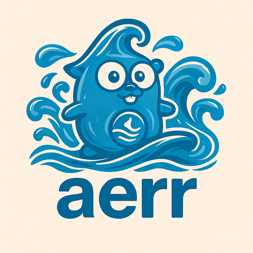

<div align="center">




**Lightweight error handling with structured logging and stack trace support for Go**

</div>

---

## Philosophy

Inspired by **"air"** (water in Indonesian), aerr embodies the natural flow of water from downstream to upstream. Just as water brings life along its journey, error information should flow seamlessly through your application layers—carrying vital context from where it originates to where it's resolved.

When errors flow smoothly with complete context (codes, messages, attributes, stack traces), engineers can diagnose and fix issues faster, bringing life back to their systems. aerr makes error tracking effortless, transforming debugging from a painful search into a clear path to resolution.

> *"Like water flowing upstream, errors should carry the important context they've collected along their journey."*

## Features

- **Automatic stack trace capture** - Every error captures where it was created with function names
- **Simplified error output** - Single code, combined message, merged attributes
- **Structured logging** - Stack traces as structured data, not strings
- **Method chaining** - Fluent API for both errors and logging
- **slog integration** - First-class support for Go's structured logging
- **High performance** - Optimized to minimize allocations
- **Zero dependencies** - Only uses Go standard library

## Installation

```bash
go get github.com/tafaquh/aerr
```

## Quick Start

```go
package main

import (
    "errors"
    "log/slog"
    "os"
    "github.com/tafaquh/aerr"
)

func main() {
    // Setup default slog logger
    slog.SetDefault(slog.New(slog.NewJSONHandler(os.Stdout, nil)))

    // Create error with builder pattern
    err := aerr.Code("DB_ERROR").
        Message("failed to query user").
        StackTrace().
        With("user_id", "123").
        With("table", "users").
        Err(errors.New("connection timeout"))

    // Just use slog.Error - it automatically structures everything!
    slog.Error("operation failed", slog.Any("err", err))
}
```

Output:
```json
{
  "time": "2025-10-31T09:07:57Z",
  "level": "ERROR",
  "msg": "operation failed",
  "err": {
    "code": "DB_ERROR",
    "message": "failed to query user: connection timeout",
    "attributes": {
      "user_id": "123",
      "table": "users"
    },
    "stacktrace": [
      "/path/to/main.go.(main.main):34"
    ]
  }
}
```

## Usage

### Builder Pattern

Create rich errors with the fluent builder API:

```go
err := aerr.Code("USER_NOT_FOUND").
    Message("failed to find user").
    StackTrace().
    With("user_id", userID).
    With("query", query).
    Err(dbErr)

// Then just log with slog
slog.Error("database operation failed", slog.Any("err", err))
```

### Start with Code or Message

```go
// Start with error code
err := aerr.Code("VALIDATION_ERROR").
    Message("invalid email format").
    With("email", email).
    Err(nil)

// Or start with message
err := aerr.Message("database query failed").
    Code("DB_ERROR").
    With("query", sql).
    Err(dbErr)
```

### Error Wrapping - Simplified Output

When you wrap errors, they're combined into a **single simplified structure**:

```go
// Layer 1: Database error
dbErr := aerr.Code("DB_ERROR").
    Message("database query failed").
    StackTrace().
    With("query", "SELECT * FROM users").
    Err(errors.New("connection timeout"))

// Layer 2: Repository wraps database error
repoErr := aerr.Code("REPOSITORY_ERROR").
    Message("failed to find user in repository").
    With("user_id", "12345").
    Wrap(dbErr)

// Layer 3: Service wraps repository error
serviceErr := aerr.Code("SERVICE_ERROR").
    Message("user service failed").
    With("operation", "GetUser").
    Wrap(repoErr)

slog.Error("request failed", slog.Any("err", serviceErr))
```

Output shows **simplified structure**:
```json
{
  "err": {
    "code": "SERVICE_ERROR",
    "message": "user service failed: failed to find user in repository: database query failed: connection timeout",
    "attributes": {
      "operation": "GetUser",
      "user_id": "12345",
      "query": "SELECT * FROM users"
    },
    "stacktrace": [
      "/path/to/database.go.(main.QueryDatabase):42",
      "/path/to/repository.go.(main.FindUser):28"
    ]
  }
}
```

**Key benefits:**
- **Single code**: Shows the outermost/top-level error code
- **Combined message**: All error messages joined with `: ` for easy reading
- **Merged attributes**: All fields from the error chain in one object
- **Deepest stacktrace**: Shows where the error originated

### Control Stack Traces

```go
// With stack trace (captures automatically with function names)
err := aerr.Code("ERR001").
    Message("something failed").
    StackTrace().
    Err(cause)

// Without stack trace (don't call StackTrace())
err := aerr.Code("ERR002").
    Message("validation failed").
    Err(nil)
```

### Stack Trace Format

Stack traces use the format `file_path.(package.function):line`. Frames in
the Go standard library (`runtime.*`, `testing.*`, `errors.*`, etc.) are
filtered out automatically so you only see your own code:

```json
"stacktrace": [
  "/home/user/project/database.go.(main.QueryDatabase):75",
  "/home/user/project/repository.go.(main.FindUserRepository):52",
  "/home/user/project/service.go.(main.GetUserService):39",
  "/home/user/project/handler.go.(main.HandleUserRequest):26",
  "/home/user/project/services/service.go.(github.com/user/project/services.(*Service).HandleRequest):142"
]
```

## API

### Building an error

- `Code(code string) *Builder` — start with an error code
- `Message(msg string) *Builder` — start with a message
- `StackTrace() *Builder` — start with stack capture enabled
- `ErrMsg(msg string) error` — one-shot shortcut for `Message(msg).Err(nil)`
- `(*Builder).Code(code) *Builder` — set the error code
- `(*Builder).Message(msg) *Builder` — set the message
- `(*Builder).StackTrace() *Builder` — enable stack capture (off by default)
- `(*Builder).With(key string, value any) *Builder` — add an attribute; re-using a key overwrites its value
- `(*Builder).Err(cause error) error` — finalize, optionally wrapping a non-aerr cause
- `(*Builder).ErrMsg(msg string) error` — finalize with a plain-text cause
- `(*Builder).Wrap(err error) error` — finalize wrapping another error; returns nil if err is nil

A `*Builder` is not safe for concurrent use and should not be reused after
`Err` / `ErrMsg` / `Wrap`. The returned `*Error` is immutable and safe to
share or log from multiple goroutines.

### Inspecting an error

- `AsAerr(err error) (*Error, bool)` — extract an `*Error` from anywhere in a chain
- `(*Error).Error() string` — the combined message
- `(*Error).Unwrap() error` — the wrapped cause (works with `errors.Is` / `errors.As`)
- `(*Error).Code() string` — the error code
- `(*Error).NumAttrs() int` — number of attributes
- `(*Error).RangeAttrs(func(key string, value any) bool)` — iterate attributes without allocating
- `(*Error).Attributes() map[string]any` — snapshot attributes as a freshly-allocated map
- `(*Error).Traces() []string` — render the filtered stack trace
- `(*Error).LogValue() slog.Value` — used automatically by `log/slog`

## Complete Example - Multi-Layer Application

### Using slog (default)

```go
package main

import (
	"errors"
	"log/slog"
	"os"

	"github.com/tafaquh/aerr"
)

func main() {
	// Setup slog default logger
	slog.SetDefault(slog.New(slog.NewJSONHandler(os.Stdout, &slog.HandlerOptions{
		Level: slog.LevelDebug,
	})))

	// Simulate an API request
	err := HandleUserRequest("12345")
	if err != nil {
		slog.Error("request failed", slog.Any("err", err))
	}
}

// HandleUserRequest simulates a controller/handler layer
func HandleUserRequest(userID string) error {
	err := GetUserService(userID)
	if err != nil {
		return aerr.Code("CONTROLLER_ERROR").
			Message("failed to handle user request").
			With("endpoint", "/api/users/"+userID).
			With("method", "GET").
			Wrap(err)
	}
	return nil
}

// GetUserService simulates a service layer
func GetUserService(userID string) error {
	err := FindUserRepository(userID)
	if err != nil {
		return aerr.Code("SERVICE_ERROR").
			Message("user service failed").
			With("service", "UserService").
			With("operation", "GetUser").
			Wrap(err)
	}
	return nil
}

// FindUserRepository simulates a repository layer
func FindUserRepository(userID string) error {
	err := QueryDatabase("SELECT * FROM users WHERE id = ?", userID)
	if err != nil {
		return aerr.Code("REPOSITORY_ERROR").
			Message("failed to find user in repository").
			StackTrace().
			With("user_id", userID).
			With("table", "users").
			Wrap(err)
	}
	return nil
}

// QueryDatabase simulates a database layer
func QueryDatabase(query string, args ...any) error {
	// Simulate a database connection error
	dbErr := errors.New("connection timeout after 5s")

	return aerr.Code("DB_ERROR").
		Message("database query failed").
		StackTrace().
		With("query", query).
		With("args", args).
		With("driver", "postgres").
		Err(dbErr)
}
```

Output shows **simplified structure** with all context:
```json
{
  "time": "2025-10-31T11:21:32.150424577+07:00",
  "level": "ERROR",
  "msg": "request failed",
  "err": {
    "code": "CONTROLLER_ERROR",
    "message": "failed to handle user request: user service failed: failed to find user in repository: database query failed: connection timeout after 5s",
    "attributes": {
      "endpoint": "/api/users/12345",
      "method": "GET",
      "operation": "GetUser",
      "service": "UserService",
      "user_id": "12345",
      "table": "users",
      "query": "SELECT * FROM users WHERE id = ?",
      "args": ["12345"],
      "driver": "postgres"
    },
    "stacktrace": [
      "/home/user/project/main.go.(main.QueryDatabase):75",
      "/home/user/project/main.go.(main.FindUserRepository):52",
      "/home/user/project/main.go.(main.GetUserService):39",
      "/home/user/project/main.go.(main.HandleUserRequest):26",
      "/home/user/project/main.go.(main.main):18"
    ]
  }
}
```

### Using zerolog

```go
package main

import (
	"errors"
	"os"

	"github.com/rs/zerolog"
	"github.com/tafaquh/aerr"
	aerrzerolog "github.com/tafaquh/aerr/zerolog"
)

func main() {
	// Enable aerr integration once, from main (same convention as
	// zerolog's pkgerrors helper).
	aerrzerolog.Register()

	// Setup zerolog logger
	logger := zerolog.New(os.Stdout).With().Timestamp().Logger()

	// Simulate an API request
	err := HandleUserRequest("12345")
	if err != nil {
		// Standard zerolog API - just works!
		logger.Error().Stack().Err(err).Msg("request failed")
	}
}

// (Same HandleUserRequest, GetUserService, FindUserRepository, QueryDatabase functions as above)
```

> **Note**: You can run both examples from the `examples/` directory:
> - `go run main.go` for slog output
> - `go run main.go -zerolog` for zerolog output

Output with **zerolog** (same simplified structure):
```json
{
  "level": "error",
  "err": {
    "code": "CONTROLLER_ERROR",
    "message": "failed to handle user request: user service failed: failed to find user in repository: database query failed: connection timeout after 5s",
    "attributes": {
      "service": "UserService",
      "user_id": "12345",
      "table": "users",
      "query": "SELECT * FROM users WHERE id = ?",
      "args": ["12345"],
      "driver": "postgres",
      "endpoint": "/api/users/12345",
      "method": "GET",
      "operation": "GetUser"
    },
    "stacktrace": [
      "/home/user/project/main.go.(main.QueryDatabase):101",
      "/home/user/project/main.go.(main.FindUserRepository):78",
      "/home/user/project/main.go.(main.GetUserService):65",
      "/home/user/project/main.go.(main.HandleUserRequest):52",
      "/home/user/project/main.go.(main.runWithZerolog):44",
      "/home/user/project/main.go.(main.main):20"
    ]
  },
  "time": "2025-10-31T16:01:45+07:00",
  "message": "request failed"
}
```

## Why aerr?

**Simple** - Builder pattern that chains naturally with your code.

**Automatic** - Implements `slog.LogValuer` for automatic structured logging.

**Simplified Output** - Single code, combined messages, merged attributes. Much easier to read!

**Rich Stack Traces** - Compact format with full function paths for quick debugging.

**High Performance** - Optimized to minimize allocations. Faster than logrus and go-kit.

**Flexible** - Add error codes, custom fields, and control stack traces.

**Compatible** - Works with standard `errors.Is()`, `errors.As()`, and `errors.Unwrap()`.

## Zerolog Integration

aerr provides optional zerolog integration through a separate package for high-performance logging.

> **Note:** `aerrzerolog.Register()` assigns the process-wide
> `zerolog.ErrorMarshalFunc` (chaining to whatever marshaler was active
> before it, so non-aerr errors keep their previous rendering). Call it
> once from `main`. If you prefer zero global configuration, render
> individual errors with
> `logger.Error().Object("err", aerrzerolog.Object(err))` instead.

### Installation

```bash
go get github.com/tafaquh/aerr/zerolog
```

### Usage

```go
import (
    "github.com/rs/zerolog"
    "github.com/tafaquh/aerr"
    aerrzerolog "github.com/tafaquh/aerr/zerolog"
)

func main() {
    aerrzerolog.Register()

    logger := zerolog.New(os.Stdout).With().Timestamp().Logger()

    err := aerr.Code("DB_ERROR").
        Message("query failed").
        StackTrace().
        With("user_id", "123").
        Err(nil)

    // Just use standard zerolog API!
    logger.Error().Stack().Err(err).Msg("operation failed")
}
```

## Performance Benchmarks

All benchmarks run on Intel Core Ultra 9 185H with 3-second benchmark time.

### slog Integration (Default)

```
BenchmarkDisabled-8                      	100M	   32.0 ns/op	      48 B/op	   1 allocs/op
BenchmarkSimpleError-8                   	6.0M	  590.0 ns/op	     208 B/op	   2 allocs/op
BenchmarkSimpleErrorWithStack-8          	1.2M	  2770  ns/op	    1417 B/op	  12 allocs/op
BenchmarkErrorWith10Fields-8             	2.7M	  1330  ns/op	     624 B/op	   3 allocs/op
BenchmarkErrorWith10FieldsAndStack-8     	844K	  3932  ns/op	    1833 B/op	  13 allocs/op
BenchmarkErrorChain-8                    	1.3M	  2770  ns/op	    1289 B/op	  11 allocs/op
BenchmarkErrorChainDeep-8                	1.0M	  3272  ns/op	    1593 B/op	  13 allocs/op
BenchmarkErrorCreation-8                 	40M 	  102   ns/op	     240 B/op	   3 allocs/op
BenchmarkErrorCreationWithStack-8        	5.9M	  674   ns/op	     288 B/op	   4 allocs/op
```

### Logger Comparison Benchmarks

**Native loggers (baseline):**
```
# Zerolog (fastest)
BenchmarkZerologSimple-8                 	62M 	  63.3 ns/op	   0 B/op	   0 allocs/op
BenchmarkZerologWith10Fields-8           	15M 	 229.8 ns/op	   0 B/op	   0 allocs/op
BenchmarkZerologWith10FieldsAndStack-8   	8.6M	 413.3 ns/op	  16 B/op	   2 allocs/op
BenchmarkZerologErrorChain-8             	5.9M	 615.4 ns/op	 200 B/op	   6 allocs/op

# Zap (very fast, structured)
BenchmarkZapSimple-8                     	14M 	 248.7 ns/op	   0 B/op	   0 allocs/op
BenchmarkZapWith10Fields-8               	5.3M	 723.4 ns/op	 704 B/op	   1 allocs/op
BenchmarkZapErrorChain-8                 	3.5M	1006   ns/op	 641 B/op	   6 allocs/op

# Logrus (mature, flexible)
BenchmarkLogrusSimple-8                  	3.1M	 1266  ns/op	 873 B/op	  19 allocs/op
BenchmarkLogrusWith10Fields-8            	805K	 4507  ns/op	3982 B/op	  52 allocs/op
BenchmarkLogrusErrorChain-8              	990K	 3915  ns/op	2663 B/op	  45 allocs/op
```

**Aerr with zerolog:**
```
BenchmarkAerrZerologSimple-8             	32M 	 116   ns/op	   0 B/op	   0 allocs/op
BenchmarkAerrZerologWith10Fields-8       	2.7M	1423   ns/op	1120 B/op	  20 allocs/op
BenchmarkAerrZerologWith10FieldsAndStack-8	831K	3778   ns/op	2034 B/op	  27 allocs/op
BenchmarkAerrZerologErrorChain-8         	2.3M	1572   ns/op	1329 B/op	  17 allocs/op
```

### Comparison Table

**Simple error:**
| Logger | Time | Bytes | Allocs | vs Fastest |
|--------|------|-------|--------|------------|
| Zerolog | 63.3 ns | 0 B | 0 | **baseline** |
| Aerr + zerolog | 116 ns | 0 B | 0 | 1.8× slower ⚡ |
| Zap | 248.7 ns | 0 B | 0 | 3.9× slower |
| Aerr + slog | 590 ns | 208 B | 2 | 9.3× slower |
| Logrus | 1266 ns | 873 B | 19 | 20× slower |

**10 fields:**
| Logger | Time | Bytes | Allocs | vs Fastest |
|--------|------|-------|--------|------------|
| Zerolog | 229.8 ns | 0 B | 0 | **baseline** |
| Zap | 723.4 ns | 704 B | 1 | 3.1× slower |
| Aerr + slog | 1330 ns | 624 B | 3 | 5.8× slower ⚡ |
| Aerr + zerolog | 1423 ns | 1120 B | 20 | 6.2× slower |
| Logrus | 4507 ns | 3982 B | 52 | 20× slower |

**Error chain (3 levels with fields):**
| Logger | Time | Bytes | Allocs | vs Fastest |
|--------|------|-------|--------|------------|
| Zerolog | 615.4 ns | 200 B | 6 | **baseline** |
| Zap | 1006 ns | 641 B | 6 | 1.6× slower |
| Aerr + zerolog | 1572 ns | 1329 B | 17 | 2.6× slower ⚡ |
| Aerr + slog | 2770 ns | 1289 B | 11 | 4.5× slower |
| Logrus | 3915 ns | 2663 B | 45 | 6.4× slower |

**Key insights:**
- **Zerolog** is the fastest logger, with zero allocations for simple cases.
- **Aerr + zerolog** is the second-fastest for simple errors and *also* zero-allocation per log call.
- **Aerr's structured-attribute output** drops the 10-field slog cost from 25 allocs to 3, because `LogValue` now emits typed `slog.Attr`s in a group instead of a reflected `map[string]any`.
- **Error chains** stay competitive — aerr + zerolog is only 2.6× slower than raw zerolog while doing automatic chain merging, attribute deduplication, and stack propagation.

**Note:** native error-chain benchmarks use `fmt.Errorf` with `%w` and add fields manually. aerr merges messages, codes, attributes, and stack traces across the chain automatically.

### Performance Analysis

**When to use each logger:**

- **Zerolog**: maximum performance (63–615 ns/op), zero allocations for simple cases, manual field management.
- **Zap**: excellent performance (249–1006 ns/op), structured logging, production-ready.
- **Logrus**: mature ecosystem (1266–4507 ns/op), flexible, good for existing projects.
- **slog**: standard library (590–2770 ns/op), no external dependencies.
- **Aerr + zerolog**: structured error chains with zero-alloc simple logging (116–1572 ns/op) — **best for rich error handling on hot paths**. ⚡
- **Aerr + slog**: stdlib only, structured errors (590–2770 ns/op).

**Optimization techniques applied:**
- **Immutable `*Error`, mutable `*Builder`** — separates the construction phase from the read phase so the error can be logged from multiple goroutines without copying.
- **Ordered attribute slice** — `[]attr` instead of `map[string]any`. Insertion order is deterministic and the map header allocation disappears entirely.
- **Typed slog group** — `LogValue` emits typed `slog.Attr`s inside a group, so slog never has to reflect over a `map[string]any`.
- **Zerolog `Dict` + `Strs`** — the zerolog adapter writes attributes through a typed dict and the stack through a `[]string` field, avoiding the reflection path in `Event.Interface`.
- **Fast-path `AsAerr`** — direct type assertion before falling back to `errors.As`, so the zerolog adapter pays the chain-walk cost at most once per error.
- **Conditional stack capture** — stacks are captured only when `StackTrace()` is called, and inner errors' PCs are inherited by `Wrap` so each chain captures at most once.
- **Real frame filtering** — `runtime.*`, `testing.*`, and stdlib frames are dropped at render time so users only see their own code.

**Trade-offs:**
- Stack capture adds roughly 500 ns–2 µs per error depending on depth; it's off by default.
- The builder/error split costs one extra small allocation at error-creation time compared to a single mutable struct.
- For sub-microsecond hot paths with manual field management, raw zerolog is still ~2× faster than aerr + zerolog.

**Recommendation:**
- Use **zerolog or zap** when you need sub-microsecond logging and can manage fields manually.
- Use **logrus** if you're already invested in its ecosystem.
- Use **slog** for stdlib-only setups without rich error handling.
- Use **aerr + zerolog** when you need automatic error-chain merging, codes, and stack traces with zero-allocation simple logging.
- Use **aerr + slog** for stdlib-only setups that still want structured error chains.

### Run Benchmarks

```bash
# Navigate to benchmarks directory
cd benchmarks

# All benchmarks
go test -bench=. -benchmem -benchtime=3s

# Compare all loggers (simple, 10 fields, error chain)
go test -bench="Simple|With10Fields|ErrorChain" -benchmem -benchtime=3s

# Only zerolog comparisons
go test -bench="Zerolog|AerrZerolog" -benchmem -benchtime=3s

# Only zap benchmarks
go test -bench="Zap" -benchmem -benchtime=3s

# Only logrus benchmarks
go test -bench="Logrus" -benchmem -benchtime=3s

# Only slog benchmarks (aerr with slog)
go test -bench="^Benchmark(Simple|Error|Disabled)" -benchmem -benchtime=3s
```

## License

MIT
